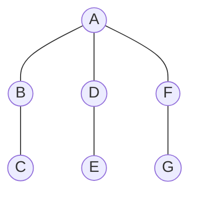
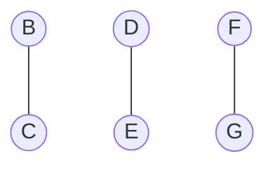

# Projet COMPLEX

## 3. Méthodes approchées

#### Question 1

Montrer que l'algorithme glouton n'est pas optimal :
Contrexemple :
Soit G=(V,E) un graphe

#### Déroulé de l'algorithme glouton :
##### Etape 1 : 
Sommet sélectionné : A
Nouveau graphe :

Les trois étapes suivantes sélectionneront un sommet pour chaque couple (B,C), (D,E) et (F,G).
Une couverture qui peut être obtenue est donc [A,B,D,F].

Or la solution optimale est [B,D,F]

Donc l'algorithme glouton n'est pas optimal. Le facteur d'approximation est $4\over3$. 
Par conséquent, dans ce cas, l'algorithme n'est pas $7\over6$-approchée.

### Question 2
TODO faire des graphes à partir des valeurs calculées

## 4. Séparation et évaluation

#### Question 2
TODO benchmark

### 4.2 Ajout de bornes
#### Question 1
Soit G un graphe, M un couplage, m le nombre d'arêtes de G de G et C une couverture de G. Alors :
$\lvert C \rvert \geq \max(b_1,b_2,b_3)$

avec :

$b_1 = \lceil{m\over\Delta}\rceil$ avec $\Delta$ le degré maximum des sommets du graphe

$b_2=\lvert{M}\rvert$

$b_3= {2n - 1 - \sqrt{(2n-1)^2 - 8m}\over 2}$

Montrons la validité des bornes :

##### Montrons $b_1$ :

Soit $G'=(S',E')$ ce graphe et $C'$ la couverture de ce graphe, de taille $x$.

Comme $C'$ est une couverture alors la somme des degrés de ses sommets est au moins égale à $m$.

$\sum_{i\in C'}{\lvert{i}\rvert} \geq m$

Comme le degré maximum des sommets est $\Delta$, on a 
$x \times \Delta \geq m$

$\Delta$ est positif et on travaille sur les entiers donc on a $x \geq \lceil{m\over \Delta}\rceil$

##### Montrons $b_2$ :
$b_2$ est valide car par définition, un couplage est un ensemble d'arêtes d'ayant pas d'extémité en commun. Il faut donc ajouter à la couverture au moins une des extrémités de chaque arête pour qu'elles soient toutes couvertes par notre couverture. 
Donc si on a un couplage M, on aura toujours au moins $\lvert{M}\rvert$ sommets dans une couverture.

##### Montrons $b_3$ :
TODO

#### Question 2 :
TODO

