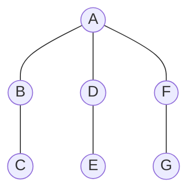
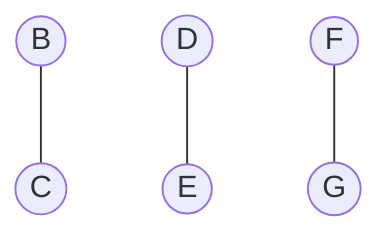

# Projet COMPLEX

## 3. Méthodes approchées

### Question 1

Montrer que l'algorithme glouton n'est pas optimal :
Contrexemple :
Soit G=(V,E) un graphe

#### Déroulé de l'algorithme glouton :
##### Etape 1 : 
Sommet sélectionné : A
Nouveau graphe :

Les trois étapes suivantes sélectionneront un sommet pour chaque couple (B,C), (D,E) et (F,G).
Une couverture qui peut être obtenue est donc [A,B,D,F].

Or la solution optimale est [B,D,F]

Donc l'algorithme glouton n'est pas optimal. Le facteur d'approximation est $4/3$. 
Par conséquent, dans ce cas, l'algorithme n'est pas $7/6$-approchée.

