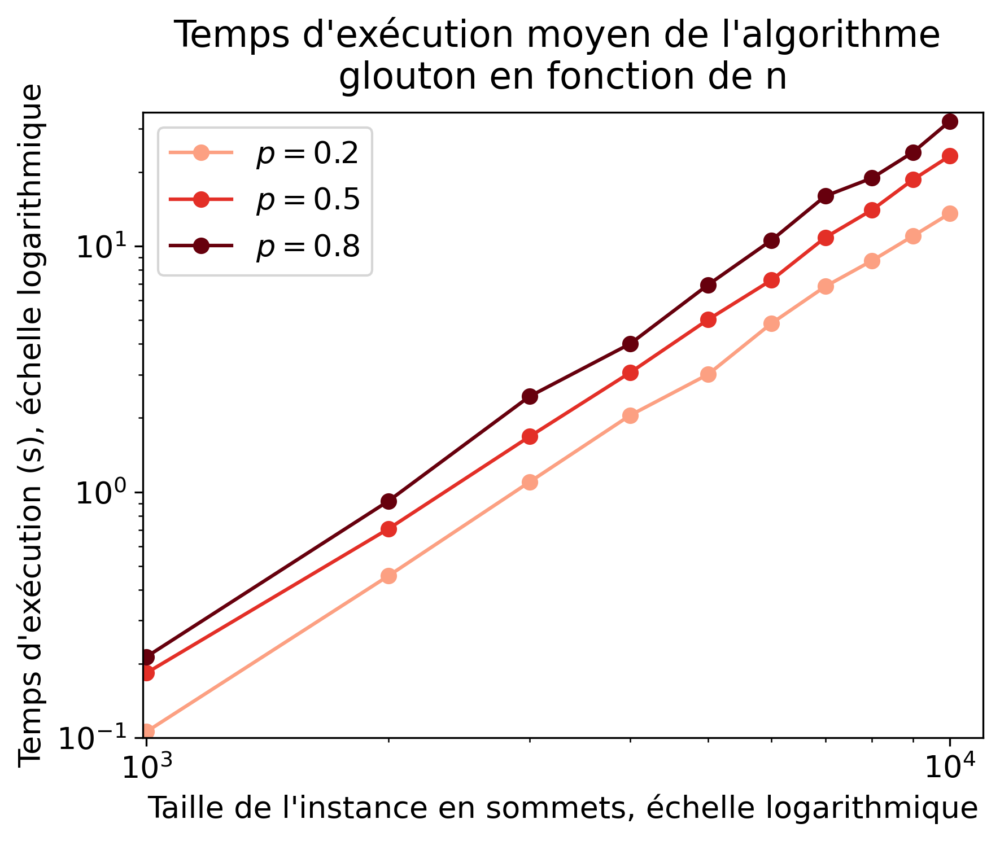

# Projet COMPLEX

[Lien pour éditer ce markdown](https://hackmd.io/@e8Tyv4S8TlC0Zl1TAgWASg/SyrdJqFZT/edit)
## 3. Méthodes approchées

#### Question 1

Montrer que l'algorithme glouton n'est pas optimal :
Contrexemple :
Soit G=(V,E) un graphe

#### Déroulé de l'algorithme glouton :
##### Etape 1 : 
Sommet sélectionné : A
Nouveau graphe :

Les trois étapes suivantes sélectionneront un sommet pour chaque couple (B,C), (D,E) et (F,G).
Une couverture qui peut être obtenue est donc [A,B,D,F].

Or la solution optimale est [B,D,F]

Donc l'algorithme glouton n'est pas optimal. Le facteur d'approximation est $4\over3$. 
Par conséquent, dans ce cas, l'algorithme n'est pas $7\over6$-approchée.

### Question 2
#### Comparaison ( Glouton VS Couplage ):

##### Temps de calcul :
L'algorithme "couplage" semble être plus rapide que l'algorithme "glouton" pour toutes les instances de taille n et pour tous les niveaux de p. Les temps d'exécution de l'algorithme "couplage" (exprimés en secondes) augmentent généralement de manière linéaire avec la taille de l'instance n et restent relativement faibles, même pour de grandes instances. D'autre part, les temps d'exécution de l'algorithme "glouton" augmentent plus rapidement avec n et p, et ils deviennent substantiels pour des instances plus grandes. Cela suggère que l'algorithme "couplage" est plus efficace sur le plan du temps de calcul.

##### Efficacité:
le comportement des deux méthodes dépend de la valeur de la probabilité p. Lorsque p est très petite, la "Méthode du couplage" peut être un peu moins efficace pour capturer des arêtes rares, tandis que pour des graphes plus denses (valeur plus grande de p), les deux méthodes peuvent donner des résultats similaires. La performance dépendra de la distribution des arêtes dans le graphe en fonction de la probabilité p.

## 4. Séparation et évaluation

#### Question 2

#### Algo Branchement basique:                
##### Temps d'exécution : 
Les temps d'exécution varient en fonction de la taille de l'instance "i" et de la probabilité de présence des arêtes "p". Il est généralement plus lent pour les valeurs élevées de "p". Les temps d'exécution vont de quelques millisecondes à plusieurs secondes.
##### Efficacité :
L'algo parvient à fournir la solution optimale. Cela signifie qu'il est capable de trouver la meilleure solution possible pour le problème donné.

### 4.2 Ajout de bornes
#### Question 1
Soit G un graphe, M un couplage, m le nombre d'arêtes de G de G et C une couverture de G. Alors :
$\lvert C \rvert \geq \max(b_1,b_2,b_3)$

avec :

$b_1 = \lceil{m\over\Delta}\rceil$ avec $\Delta$ le degré maximum des sommets du graphe

$b_2=\lvert{M}\rvert$

$b_3= {2n - 1 - \sqrt{(2n-1)^2 - 8m}\over 2}$

Montrons la validité des bornes :

##### Montrons $b_1$ :

Soit $G'=(S',E')$ ce graphe et $C'$ la couverture de ce graphe, de taille $x$.

Comme $C'$ est une couverture alors la somme des degrés de ses sommets est au moins égale à $m$.

$\sum_{i\in C'}{\lvert{i}\rvert} \geq m$

Comme le degré maximum des sommets est $\Delta$, on a 
$x \times \Delta \geq m$

$\Delta$ est positif et on travaille sur les entiers donc on a $x \geq \lceil{m\over \Delta}\rceil$

##### Montrons $b_2$ :
$b_2$ est valide car par définition, un couplage est un ensemble d'arêtes d'ayant pas d'extémité en commun. Il faut donc ajouter à la couverture au moins une des extrémités de chaque arête pour qu'elles soient toutes couvertes par notre couverture. 
Donc si on a un couplage M, on aura toujours au moins $\lvert{M}\rvert$ sommets dans une couverture.

##### Montrons $b_3$ :
TODO

#### Question 2 :
TODO

#### Question 3 :

#### Branchement amélioré 1: 
( prendre tous les voisins dans la 2eme branche )

##### Temps d'exécution : 
L'algorithme présente un temps d'exécution très faible, proche de zéro, pour la plupart des instances testées. Cela suggère une amélioration significative par rapport à l'algorithme de base, qui avait des temps d'exécution plus longs.

##### Efficacité : 
L'algorithme est toujours capable de produire des solutions optimales, dans un temps d'exécution très court.

#### Branchement amélioré 2: 
( choisir le branchement de maniere à ce que le sommet soit de degre maximum )

##### Temps d'exécution : 
Les algorithmes "Amélioré 1" et "Amélioré 2" montrent des temps d'exécution extrêmement courts, presque nuls, dans la plupart des cas. Cependant, il est important de noter que "Amélioré 2" se distingue de manière significative par sa rapidité, surpassant généralement "Amélioré 1".

##### Efficacité : 
En ce qui concerne la qualité des solutions, les deux donnent des résultats similaires.

#### Question 4 :

Les algorithmes de couplage et glouton présentent généralement des rapports d'approximation élevés, proches de 1. Même lorsque la taille de l'instance "n" varie, les rapports d'approximation restent globalement performants, avec de légères fluctuations. Les pires rapports d'approximation observés étaient toujours proches de 1, confirmant la fiabilité de ces algorithmes pour résoudre le problème.

