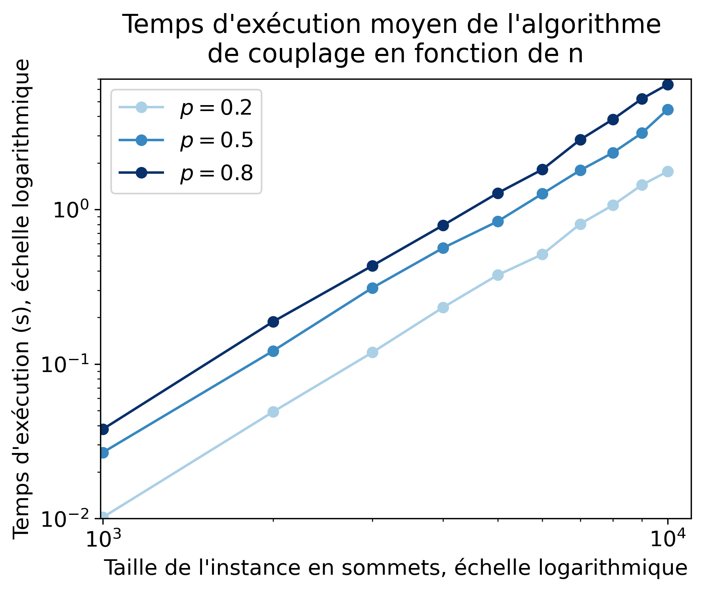
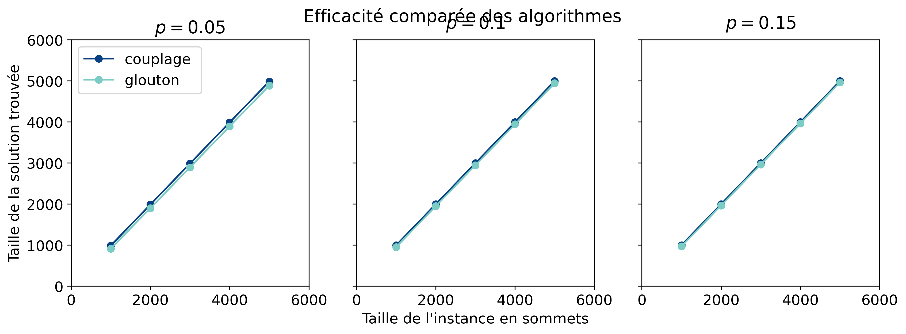
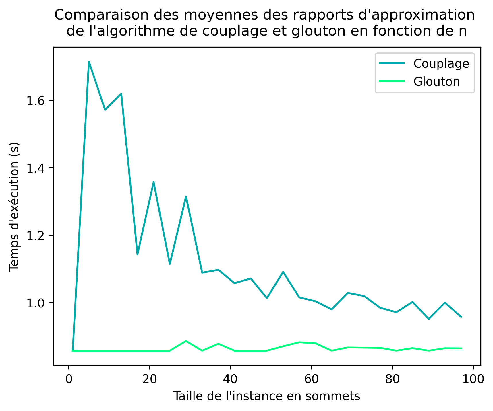

# Projet COMPLEX

### Natacha RIVIERE et Imane HADBI

## 2. Graphes

La représentation du graphe choisie est basée sur un dictionnaire Python. Dans cette représentation :

- Les clés du dictionnaire sont les sommets du graphe, qui sont généralement des entiers.
- Les valeurs associées à chaque clé sont des ensembles (sets) contenant les voisins de ce sommet.

## 3. Méthodes approchées

#### Question 1

Montrer que l'algorithme glouton n'est pas optimal :
Contrexemple :
Soit G=(V,E) un graphe

#### Déroulé de l'algorithme glouton :
##### Etape 1 : 
Sommet sélectionné : A
Nouveau graphe :

Les trois étapes suivantes sélectionneront un sommet pour chaque couple (B,C), (D,E) et (F,G).
Une couverture qui peut être obtenue est donc [A,B,D,F].

Or la solution optimale est [B,D,F]

Donc l'algorithme glouton n'est pas optimal. Le facteur d'approximation est $4\over3$. 
Par conséquent, dans ce cas, l'algorithme n'est pas $7\over6$-approchée.

#### Question 2
#### Comparaison ( Glouton VS Couplage ):

##### Temps de calcul :
Le profil des deux courbes suivantes, avec des échelles logarithmiques, suggèrent que le temps d'éxécution des algorithmes couplages et glouton suivent une tendance exponentielle. Ce qui est cohérent avec le fait que le problème de couverture soit NP-complet, les algorithmes que nous utilisons ne sont pas polynomiaux.

En revanche, l'algorithme couplage est beaucoup plus rapide que l'algorithme glouton. En effet, pour une instance de 10 mille sommets, l'algorithme de couplage trouve une solution en environ 6 secondes, contre environ 35 secondes pour l'algorithme glouton.

On observe qu'en faisant varier p, le temps d'éxécution varie également. Plus p est grand, plus de temps de calcul est élevé, ce qui est cohérent car plus p est grand, plus l'algorithme doit traiter d'arêtes. En revanche, le profil des courbes reste exponentiel même avec p très petit.

##### Efficacité:
Les courbes suivantes ont pour objectif de déterminer quel algorithme est le plus efficace pour trouver une solution proche de l'optimal. On cherche à trouver une solution de taille minimale. On constate alors que l'algorithme glouton trouve toujours des meilleures solutions que l'algorithme de couplage. Cette différence est plus marquée sur des p plus petits. 
En revanche, elle est assez minime plus p augmente. A la lumière des analyses précédentes, on peut suggérer que même si l'algorithme glouton génère de meilleures solutions que l'algorithme de couplage, il est beaucoup trop lent à calculer et il vaudra mieux utiliser l'algorithme de couplage dans la suite de ce devoir.

## 4. Séparation et évaluation

#### Question 2

#### Algo Branchement basique:                
##### Temps d'exécution : 
L'algorithme de branchement basique parcours toutes les possibilités de couverture possible, ce qui revient à éxécuter $2^n$ fois l'algorithme de couplage. Quand n augmente, le nombre de calculs à effectuer augmente très vite. Avec cet algorithme, on peut trouver rapidement une solution pour un graphe de moins de 25 sommets. Au delà, les calculs sont trop longs.
Comme l'algorithme de couplage, qui est effectué pour chaque possibilité, est plus rapide pour des p plus petits, on retouve cette différence de vitesse dans les courbes suivantes.
##### Efficacité :
L'algo parvient à fournir la solution optimale. Cela signifie qu'il est capable de trouver la meilleure solution possible pour le problème donné. 

#### 4.2 Ajout de bornes
#### Question 1
Soit G un graphe, M un couplage, m le nombre d'arêtes de G de G et C une couverture de G. Alors :
$\lvert C \rvert \geq \max(b_1,b_2,b_3)$

avec :

$b_1 = \lceil{m\over\Delta}\rceil$ avec $\Delta$ le degré maximum des sommets du graphe

$b_2=\lvert{M}\rvert$

$b_3= {2n - 1 - \sqrt{(2n-1)^2 - 8m}\over 2}$

Montrons la validité des bornes :

##### Montrons $b_1$ :

Soit $G'=(S',E')$ ce graphe et $C'$ la couverture de ce graphe, de taille $x$.

Comme $C'$ est une couverture alors la somme des degrés de ses sommets est au moins égale à $m$.

$\sum_{i\in C'}{\lvert{i}\rvert} \geq m$

Comme le degré maximum des sommets est $\Delta$, on a 
$x \times \Delta \geq m$

$\Delta$ est positif et on travaille sur les entiers donc on a $x \geq \lceil{m\over \Delta}\rceil$

##### Montrons $b_2$ :
$b_2$ est valide car par définition, un couplage est un ensemble d'arêtes d'ayant pas d'extémité en commun. Il faut donc ajouter à la couverture au moins une des extrémités de chaque arête pour qu'elles soient toutes couvertes par notre couverture. 
Donc si on a un couplage M, on aura toujours au moins $\lvert{M}\rvert$ sommets dans une couverture.

##### Montrons $b_3$ :

Considérons le nombre maximal d'arêtes qu'un graphe peut avoir, donc dans un graphe complet :

$m_{max} = {n*(n-1)\over 2}$

En considérant que toutes les arêtes du graphes sont couvertes par la couverture $C$ on peut calculer le nombre d'arêtes d'un graphe en retirant le nombre maximal d'arêtes non couvertes par $C$. Posons $|C| = c$.

On peut majorer le nombre d'arêtes d'un graphe couvert par la couverture C par cette formule :

$m \leq {n*(n-1)\over 2} - {(n-c)*(n-c-1)\over 2}$

En effet, au maximum, un graphe couvert par la couverture $C$ peut contenir toutes les arêtes qui relie les sommets de la couverture, sans les arêtes qui relient les sommets hors de la couverture car par définition, elles ne peuvent pas exister.

On développe cette expression pour obtenir :

$m \leq {2nc - c^2 - c \over 2}$

On souhaite trouver les racines de ce polynôme:

${2nc - c^2 - c \over 2} - m \leq 0$

$-{1 \over 2} c^2 + {2n-1 \over 2} c -m \leq 0$

On calcule le discriminant :

$\Delta = ({2n-1 \over 2})^2 - 4 *-{1 \over 2} * -m $

$\Delta = {(2n-1)^2-8m \over 4}$

On calcule ensuite les racines du polynome :

$X_1 = {-{2n-1 \over 2} + \sqrt{(2n-1)^2-8m \over 4}\over -1}$ 

$X_1 = {2n-1  - \sqrt{(2n-1)^2-8m}\over 2}$

et 

$X_2 = {-{2n-1 \over 2} - \sqrt{(2n-1)^2-8m \over 4}\over -1}$ 

$X_2 = {2n-1  + \sqrt{(2n-1)^2-8m}\over 2}$

Notons que l'on reconnait la borne $b_3$ en $X_1$

Comme le coefficient de $c^2$ est négatif, la courbe associée à cette équation, qui est une parabole, est orientée vers le bas. Notre inéquation cherche à trouver les solutions telles que le polynôme soit positif. Comme notre plus petite solution est $X_1$, les solutions de cette équation sont toutes les valeurs de $C$ comprises entre $X_1$ et $X_2$. Donc $X_1 (=b_3)$ est une borne inférieure à la taille de $C$.

#### Question 2 :
En ajoutant le calcul d'une borne inférieure et d'une borne supérieure en chaque noeud, on réduit énormément le nombre de calculs à faire car au lieu de calculer toutes les possibilités, on n'explore que les noeuds qui sont intéressants. 

Lorsque l'on compare les temps de calcul des deux algorithmes, la différence est très nette. L'algorithme borné prend beaucoup moins de temps que le précédent lorque n augmente.

#### Question 3 :

#### Branchement amélioré 1: 
( prendre tous les voisins dans la 2eme branche )

##### Temps d'exécution : 
L'algorithme présente un temps d'exécution très faible, proche de zéro, pour la plupart des instances testées. Cela suggère une amélioration significative par rapport à l'algorithme de base, qui avait des temps d'exécution plus longs.

##### Efficacité : 
L'algorithme est toujours capable de produire des solutions optimales, dans un temps d'exécution très court.
En revanche, on constate que pour des valeurs de p très petites, l'algorithme prend beaucoup plus de temps que pour des p plus grands. Cela peut être contre-intuitif car le graphe obtenu est plus petit. 

Ceci s'explique car l'amélioration est de prendre tous les voisins du sommet sélectionné plutôt que seulement un sommet. Dans les graphes moins denses, les ensembles de voisins sont très réduits et nous ne réduisons donc pas très vite le nombre de sommets à étudier.

La courbe suivante présente les temps de calcul de cet algorithme en fonction de la taille de l'instance pour p=0.8.

On constate que la courbe produite a un profil exponentiel, ce qui confirme que cet algorithme n'est toujours pas polynomial, ce qui correspond bien au fait que le problème est NP-difficile.

#### Branchement amélioré 2: 
( choisir le branchement de maniere à ce que le sommet soit de degre maximum )

##### Temps d'exécution : 
L'algorithme amélioré 2 présente un profil général très similaire à l'amélioration 1. On a toujours un temps de calcul plus élevé pour les petites valeurs de p. Il est donc intéressant de comparer les temps d'exécution des deux algorithmes pour plusieurs valeurs de p.

Pour p=0,8 il n'y a presque aucune différence entre les deux algorithmes. La version améliorée 2 est légèrement plus rapide que la première sur des plus grandes instances.

En revanche, pour p=0,2 la différence est notable. La version améliorée 2 est nettement plus rapide. Comme elle sélectionne le sommet de degré maximal, elle permet d'éliminer le plus de sommets possible en peu d'itération, même si le graphe est peu dense.

#### Question 4 :

L'algorithme glouton présente un rapport d'approximation bien plus proche de 1 que l'algorithme de couplage pour toutes les instances étudiées. Ses solutions sont donc bien plus proches de la solution optimale que celles de l'algorithme de couplage. 

De plus on constate que plus les instances grandissent, plus les solutions trouvées par couplage sont proches de la solution optimale, et des solutions de glouton.

Dans notre cas, les pires rapports d'approximation observés sont :
- algorithme glouton : 1.25
- algorithme de couplage : 2